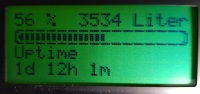

# Arduino.Ethernet.Zisterne

## Beschreibung
Dieses Projekt ermöglicht eine Füllstandsmessung per Pegelsonde.
Zur Verwendung kommt ein Arduino Nano, ein W5100 Ethernet Shield, 
ein 4-20mA Stromwandler und ein 4x16 Zeichen LCD mit I2C Schnittstelle.

Die Meßdaten werden per MQTT an einen Server übertragen und auf dem Display angezeigt.

In der ino Datei müssen noch entsprechende Anpassungen gemacht werden.
Diese sind am Anfang des Codes.

- Volumen der Zisterne   
- IP-Adresse des MQTT Servers   
- IP-Adresse des Nano (falls kein DHCP zur Verfügung steht)   
- MAC-Adresse des Nano   

## Changelog

### 1.1
- (20191019 Eisbaeeer)   
- Dichte Berechnung hinzugefügt   
- Prüfung auf max. Liter in der Anzeige nur bei Wasser

### 1.0
- (Eisbaeeer)
Initial Version

## License
The MIT License (MIT)
Copyright (c) 2019 Eisbaeeer <eisbaeeer@gmail.com> 
